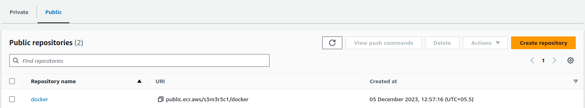
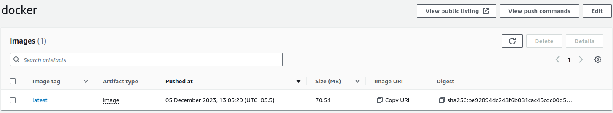
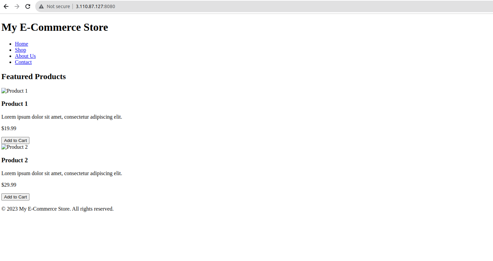

# Dockerizing a Plain HTML Page with Nginx

* First we need to create & customize a index.html file

```txt
<header>
    <h1>My E-Commerce Store</h1>
    <nav>
        <ul>
            <li><a href="#">Home</a></li>
            <li><a href="#">Shop</a></li>
            <li><a href="#">About Us</a></li>
            <li><a href="#">Contact</a></li>
        </ul>
    </nav>
</header>

<main>
    <section class="featured-products">
        <h2>Featured Products</h2>
        <div class="product">
            
            <h3>Product 1</h3>
            <p>Lorem ipsum dolor sit amet, consectetur adipiscing elit.</p>
            <p class="price">$19.99</p>
            <button>Add to Cart</button>
        </div>

        <div class="product">
            
            <h3>Product 2</h3>
            <p>Lorem ipsum dolor sit amet, consectetur adipiscing elit.</p>
            <p class="price">$29.99</p>
            <button>Add to Cart</button>
        </div>

        <!-- Add more products as needed -->
    </section>
</main>

<footer>
    <p>&copy; 2023 My E-Commerce Store. All rights reserved.</p>
</footer>

</body>
</html>
```

## Now configure a ngix.conf file for this index.html

```txt
# nginx.conf
server {
    listen 80;
    server_name localhost;

    location / {
        root /usr/share/nginx/html;
        index index.html;
    }
}
```

## Now create a dockerfile for build the image from these files

```yml
FROM nginx:latest

COPY nginx.conf /etc/nginx/conf.d/default.conf
COPY index.html /usr/share/nginx/html/

EXPOSE 80

CMD ["nginx", "-g", "daemon off;"]
```

## Build the docker image

```txt
docker build . -t myimage3
```

## Now we have to configure aws cli in our EC2 instance to push this docker image to the ECR registry

```bash
sudo apt install awscli
```

```bash
aws configure
```

* Give the access key and secret key, region and format to configure aws cli

* Now go the aws console and navigate to ECR registry and create a ecr public repository to store this image.




* Use the push commands inorder to push the local image to the ecr repository

* You can login into the ecr by using the push commands

```bash
aws ecr-public get-login-password --region us-east-1 | docker login --username AWS --password-stdin *****
```

```bash
sudo docker build -t docker .
```

```bash
sudo docker tag docker:latest public.ecr.aws/s3m3r3c1/docker:latest
```

```bash
sudo docker push public.ecr.aws/s3m3r3c1/docker:latest
```

* Finally we have pushed our image to the ECR REGISTERY




* We need to run and check our image is working or not 

* For that you have enable the inbound rules and open the port 8080 and run this command

```bash
sudo docker run -p 8080:80 public.ecr.aws/s3m3r3c1/docker:latest
```

